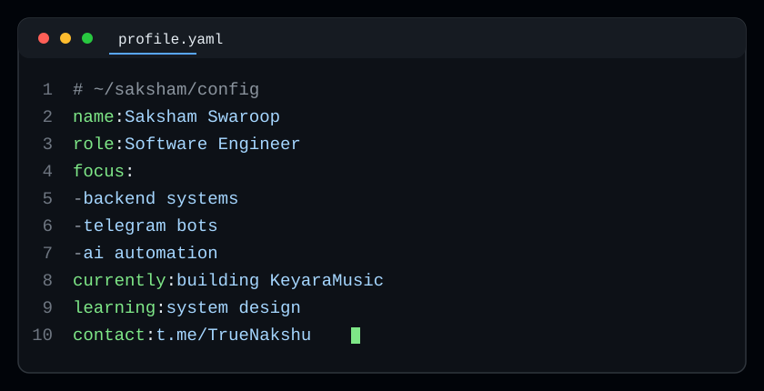

  

  
&nbsp;
  
&nbsp;
  

  

  

---

## 📊 GitHub Stats

  
&nbsp;
  

  
&nbsp;
  

  

---

## 🐍 Contribution Snake

<picture>
  
</picture>

---

## 🧰 Tech Stack

  

---

## 🚀 Featured Projects

| Project | About |
|:---|:---|
| 🎧 **[KeyaraMusic](https://github.com/VIP-saksham/KeyaraMusic)** | Telegram music bot — streaming engine with ~1-2s VC playback, LLM self-heal agent, scheduled auto-restarts |
| 🎵 **[HellXMusic](https://github.com/VIP-saksham/HellXMusic)** | Advanced music bot for group voice chats — YouTube, Spotify & more |
| 🔑 **[StringSessionXD](https://github.com/VIP-saksham/StringSessionXD)** | Telegram session generator — force-join system, admin panel, 136+ tested cases |
| 🛡️ **[BioLink-Protector](https://github.com/VIP-saksham/BioLink-Protector)** | Telegram bio-link protection bot |
| 🕹️ **[CarRacing](https://github.com/VIP-saksham/CarRacing)** · **[CrushMasterGame](https://github.com/VIP-saksham/CrushMasterGame)** · **[SpaceWar-1](https://github.com/VIP-saksham/SpaceWar-1)** | Python game experiments |

---

## 🏆 Achievements

<table>
<tr>
<td align="center" width="25%"><a href="https://github.com/VIP-saksham?tab=achievements#pull-shark"> <b>Pull Shark</b> merged pull requests</a></td>
<td align="center" width="25%"><a href="https://github.com/VIP-saksham?tab=achievements#yolo"> <b>YOLO</b> merged without review</a></td>
<td align="center" width="25%"><a href="https://github.com/VIP-saksham?tab=achievements#quickdraw"> <b>Quickdraw</b> closed in 5 min ⚡</a></td>
<td align="center" width="25%"><a href="https://github.com/VIP-saksham?tab=achievements#pair-extraordinaire"> <b>Pair Extraordinaire</b> ×4 co-authored PRs</a></td>
</tr>
</table>

---

## 🌐 Find me at

  

